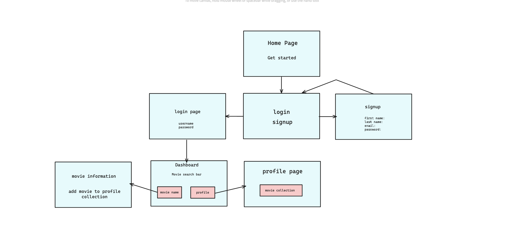

# Film Finder (project 2)
Here, you can search for movies, add your favorites to your personal list, and remove them whenever you like. 

# User Stories
- Have the user signup and login
- The user can search any movies and add it to their favorite movie collection
- The user can click on the movie image to see more details about that specific movie
- The user can submit, edit, or delete a movie review
- Allow the user to edit or delete the movie in their collection

# Installation
1. Git clone the repository
2. In the command line run the following commands once you have the project opened in vs code: 
   `npm install`

# Technologies used

## API:
- TMDB API
## Backend:
- Node
- Express
- Passport
- Bcrypt
- dotenv
- Mongoose
- MongoDB
- Method-override

## Frontend:
- HTML
- CSS
- EJS (Embedded JavaScript)
- JavaScript

## Code Snippets:
## Movies get route:
```js
app.get('/movies/:tmdb_id', async (req, res) => {
    try {
        const tmdbId = req.params.tmdb_id;

        let movie = await Movie.findOne({ tmdb_id: tmdbId }).populate('reviews');

        if (!movie) {
            const response = await axios.get(`${BASE_URL}/movie/${tmdbId}`, {
                params: { api_key: API_KEY }
            });

            const movieData = response.data;
            movie = new Movie({
                title: movieData.title,
                overview: movieData.overview,
                release_date: movieData.release_date,
                genres: movieData.genres.map(genre => genre.name),
                poster_path: movieData.poster_path,
                tmdb_id: tmdbId
            });

            await movie.save();
        }

        res.render('movieInfo', { movie });
    } catch (err) {
        console.error('Error fetching movie details:', err);
        res.status(500).send('Error fetching movie details');
    }
});
```
## movieGet.js
```js
const axios = require('axios');
require('dotenv').config();

const API_KEY = process.env.API_KEY;
const BASE_URL = 'https://api.themoviedb.org/3';
const IMAGE_BASE_URL = 'https://image.tmdb.org/t/p/w500';  // Base URL for TMDB
const searchMovie = async (query) => {
    try {
        const response = await axios.get(`${BASE_URL}/search/movie`, {
            params: {
                api_key: API_KEY,
                query: query
            }
        });
        
        const results = response.data.results.map(movie => ({
            tmdb_id: movie.id,
            title: movie.title,
            poster_url: `${IMAGE_BASE_URL}${movie.poster_path}`,
            release_date: movie.release_date,
            overview: movie.overview
        }));
        return results;
    } catch (error) {
        console.error(error);
        return [];
    }
};

module.exports = { searchMovie };

```

# Wireframe


# ERD
### User
id, name, phone, email, password
### movie
id, title, overview, release_date, genres, poster_path
### reviews
id, user, date, created_at

# Current issues
- The user is able to favorite the same movie (create a duplicate)
- The user can't see the review of the specific movie in their profile page

# Future changes/considerations
- Add TV shows and different genres for the user to search
- Add a watchlist feature
